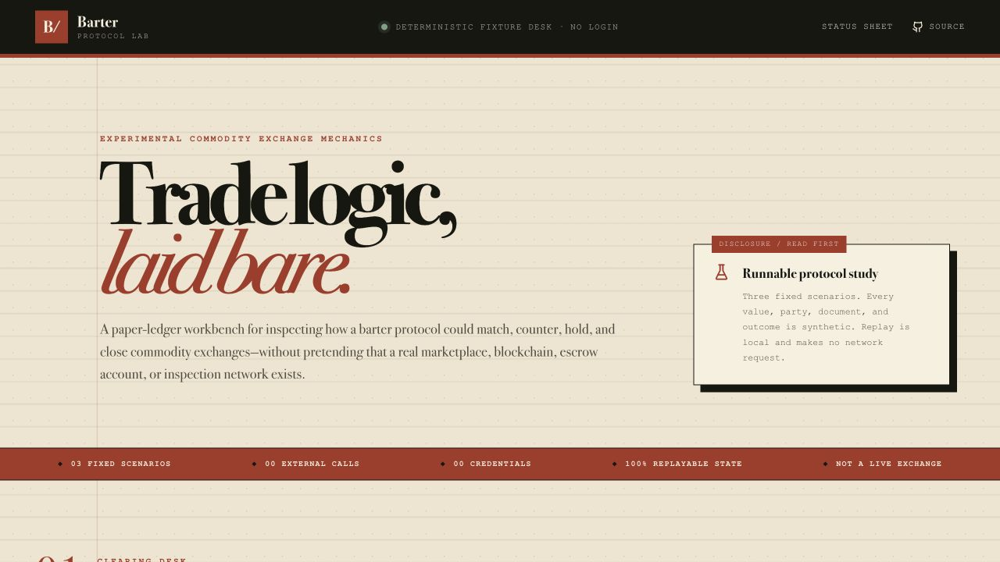

# Barter Protocol Lab

An interactive commodity-exchange protocol demonstrator: three synthetic trades, one deterministic state machine, and an immutable event tape you can replay without accounts, secrets, a database, or external services.

[](https://github.com/fortunexbt/barter/actions/workflows/ci.yml)




The showcase route is **`/lab`**. Its visual language borrows from a 1970s commodity clearing desk: warm paper stock, drafting ink, customs-stamp green, red ledger rules, and monospaced manifests.

## What you can replay

| Folio | Scenario | State path | Outcome |
| --- | --- | --- | --- |
| PL-0174-A | Copper cathodes / green coffee | match → terms → inspection | simulated settlement |
| PL-0288-B | Durum wheat / freight capacity | match → counter → revised terms | simulated settlement |
| PL-0312-C | Cocoa beans / machine bearings | match → inspection hold | clean cancellation |

Every timestamp, valuation, event, and journal fingerprint is fixed. Replaying the same scenario at the same step produces the same snapshot. The demo makes no network requests and moves no money, title, token, or commodity.

## Run it

Requirements: Node.js 20+ and npm.

```bash
npm install
npm run dev
```

Open [http://localhost:5000/lab](http://localhost:5000/lab). No `.env`, sign-in, Postgres instance, wallet, or API key is needed.

To exercise the complete quality gate:

```bash
npm run verify
```

That command runs TypeScript checking, deterministic state-machine tests, and the production build.

## Capability ledger

The repository began as a broad marketplace prototype. This revival keeps that surface available for exploration while drawing a hard line between working software and product concepts.

| Status | Included |
| --- | --- |
| Implemented | Public protocol lab, deterministic reducer, three replay fixtures, event journal, responsive UI, session authentication, in-memory development storage, optional Postgres adapter |
| Simulated | Commodity reference values, counterparties, matching, inspection evidence, agreement records, escrow states, identity checks, settlement receipts |
| Roadmap | Live market data, regulated identity provider, inspection network, custody or payment rails, legal title transfer, blockchain anchoring, production matching engine |

The authenticated `/auth` workspace is explicitly marked **legacy prototype**. It is useful for exploring screens and data flows, but it is not a live marketplace and must not receive real identity documents, funds, wallet keys, or commercially sensitive data.

## Architecture

```text
/lab UI ──> fixed scenario fixtures ──> pure replay reducer ──> snapshot + event tape

legacy UI ──> Express REST API ──> in-memory adapter (default)
                              └──> PostgreSQL adapter (optional)
```

The lab deliberately sits outside the authentication provider and storage layer. This keeps the showcase portable and makes its claims independently testable. The reducer rejects invalid transitions, clamps replay boundaries, and derives a stable journal mark from applied events.

Key files:

- `client/src/features/protocol-lab/demo-engine.ts` — scenarios and replay engine
- `client/src/features/protocol-lab/demo-engine.test.ts` — deterministic contract tests
- `client/src/pages/protocol-lab-page.tsx` — public interactive showcase
- `server/storage.ts` — typed in-memory adapter and optional database selection
- `shared/schema.ts` — shared domain model

## Optional database mode

Without `DATABASE_URL`, the server starts with deterministic in-memory fixtures. For persistent local development, copy `.env.example`, provide a PostgreSQL connection string, and run:

```bash
npm run db:push
npm run dev
```

A persistent production deployment must set a strong `SESSION_SECRET`. See `.env.example` for the supported variables.

## Security boundary

- Registration always creates a standard trader account; clients cannot assign themselves admin or verified status.
- Password hashes are excluded from authentication responses.
- Session cookies are HTTP-only, same-site, and secure in production.
- Identity screens accept only three named synthetic fixture IDs—there is no file picker or free-text document intake—and the API rejects every other value.
- The legacy WebSocket endpoint fails closed until session-authenticated upgrades are implemented.
- Production dependencies are audited in CI; `npm audit --omit=dev` reports zero known vulnerabilities at this revision.
- The repository has not been audited for custody, compliance, or production commodity trading.

## Scripts

| Command | Purpose |
| --- | --- |
| `npm run dev` | Start Express and Vite on port 5000 |
| `npm run check` | Run the TypeScript compiler |
| `npm test` | Test deterministic replay invariants |
| `npm run build` | Build browser and server bundles |
| `npm run verify` | Run check, tests, and build |
| `npm run db:push` | Push the optional Drizzle schema |

## License

MIT © 2026 FortuneXBT. See [LICENSE](LICENSE).
